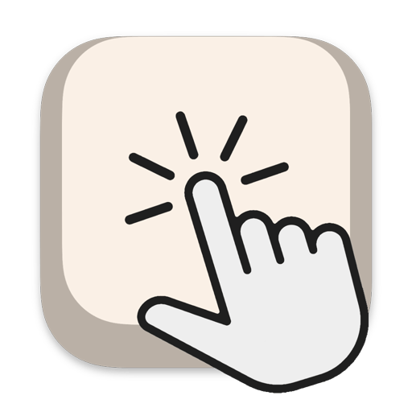

<h1 align="center">Click</h1>

 

### Mechanical Keyboard sounds.

Transform your Mac typing experience with the satisfying sounds of premium mechanical keyboards. Using high-quality [Mechvibes](https://github.com/hainguyents13/mechvibes/) sound packs, Click brings the tactile audio feedback of mechanical switches to any keyboard.

## Features

🎵 Premium Sound Quality
- Authentic mechanical keyboard recordings
- Multiple popular switch types including EG Crystal Purple, EG Oreo, and more to come
- Zero latency audio playback

⚡ Performance Focused
- Minimal CPU usage
- Runs efficiently in the background
- No impact on battery life

⚙️️ Easy to Use
- Works instantly with your existing keyboard
- Simple, intuitive controls
- Clean, native macOS design

## Installation

1. Download Click:
   1. [Mac App Store](https://apps.apple.com/us/app/click-keyboard-sounds/id6740429323): Get automatic updates
   2. [GitHub Releases](https://github.com/pruizlezcano/click/releases/latest): Manual updates required
2. Launch the app
3. Grant accessibility permissions when prompted
4. Select your preferred switch sound
5. Start typing and enjoy!

## System Requirements

- macOS 14.0 Sonoma or later
- Compatible with Apple Silicon and Intel processors
- Minimal disk space required

## Privacy & Permissions

Click requires accessibility permissions to detect keystrokes. We do not collect or store any typing data - all processing happens locally on your device.

## Support & Troubleshooting

### Troubleshooting

If you don't hear any sounds:
- Ensure accessibility permissions are granted in System Settings.
- Check your system volume and output device.
- Restart the app if needed.

### Need Help?

For support or feature suggestions, visit the [GitHub Issues](https://github.com/pruizlezcano/click/issues) page.
